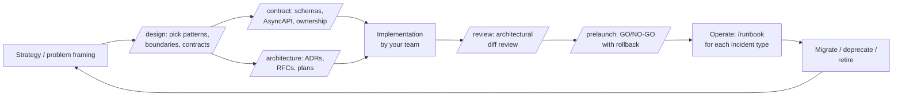

# Distributed Systems Patterns Skill

<p align="left">
  
</p>

A connected system for designing distributed systems **at scale**. Produces design docs, ADRs, RFCs, message contracts, runbooks, readiness assessments, and launch decisions that link into a per-feature index and a system-level catalog. Covers integration patterns plus the layer beyond code: team ownership and Conway boundaries, multi-tenancy, cost ownership, compliance, capacity, disaster recovery, and lifecycle. Default outputs are architectural artifacts; specific library choices stay with the team.

> Heads up: this is a heavy-duty toolkit for production systems with real cross-team coordination problems. If you're working alone, on a prototype, or on a single-process app, [skip ahead](#who-this-is-for) — you'll likely overengineer.

## Who this is for

Distributed-systems engineers, tech leads, staff/principal engineers, platform teams, and architects making cross-service decisions at scale. The artifacts the skill produces (design docs, ADRs, contracts, runbooks, launch decisions) are durable, multi-team coordination tools. They earn their keep when:

- Multiple services or teams must agree on contracts and ownership.
- A change introduces durable infrastructure (a broker, workflow engine, schema registry, mesh, cache fleet, shard, or new consistency model).
- The work needs decision artifacts that outlast the code (ADRs that future hires can read; runbooks that on-call engineers reach for at 2 a.m.).

> **Warning: do NOT use this skill for small projects.** Running the full pipeline on a side project, hackathon, class assignment, or scrappy MVP is overengineering theater. You will produce ten markdown files for code that doesn't exist yet. The skill assumes ≥2 services, real users, real operational cost, and real failure modes worth planning around. If those don't apply yet, a regular prompt without slash commands is faster, clearer, and produces less ceremony.

### Concrete don't-use cases

The skill is wrong for:

- **Side projects and hobby code.** Nobody but you will read the ADR.
- **Hackathons and prototypes.** Decisions you'll abandon in a week don't need durable artifacts.
- **Single-process apps.** A Flask/Express/FastAPI service with one Postgres database doesn't have the cross-team coordination problem the skill solves.
- **Frontend-only work.** UI components, React/Vue/Svelte apps, design-system code.
- **CRUD apps without async work.** REST endpoints over a single database, no queues, no background jobs.
- **Single-team startups under ~10 engineers.** Conway's Law says the architecture mirrors team structure; with one team there's no boundary to negotiate.
- **Single-function utilities.** A script, a lambda that does one thing, a CLI tool.
- **Beginner pattern questions.** "What is a queue?" "When do I use Redis vs Memcached?" — the skill assumes you already know.
- **ETL and batch pipelines that don't coordinate services.** Airflow DAGs that move data between two databases without crossing team boundaries.
- **Internal tools with single-digit users.** Admin dashboards, ops scripts, debug consoles.

### When the skill earns its weight

- A platform team and a product team need to agree on event contracts.
- You're introducing Kafka/SQS/RabbitMQ/Pub/Sub/Temporal where there wasn't async messaging before.
- Multiple services consume the same events and need a shared schema-evolution policy.
- You're going multi-region or multi-tenant.
- Compliance (PCI, SOC2, GDPR, HIPAA) requires audited decision trails.
- You're carrying production-grade SLOs and on-call rotations.

If your project doesn't fit any of these, the skill is overhead, not help.

### What the skill does when invoked below the threshold

When activated on a request that doesn't meet the threshold, the skill is configured to **decline the full pipeline** and respond with a simpler answer instead. If you see a normal conversational answer for what felt like a distributed-systems question, that's the skill correctly recognizing the work is below its bar.

## Quickstart

Once installed (see below), the typical flow for a new feature is:

```text
/design payment-authorization Multi-tenant SaaS, PCI-DSS scope, p99
100 authorizations/sec, RTO 5 min. Owner: Payments Platform.
Triggered by orders.placed.v1; emits payments.authorized.v1.
```

Read the design at `docs/features/payment-authorization/design.md`. Approve or revise.

```text
/contract payments.authorized.v1 Owner: Payments Platform.
Producer: payments-service. Consumers: orders, notifications.
Per-account ordering. PCI-out (token-only).
```

Read the contract at `docs/features/payment-authorization/contracts/`. Iterate.

Then your team writes the implementation in their normal dev environment. When the diff lands, run `/review` for an architectural review. When you're ready to launch, run `/prelaunch` for the GO/NO-GO decision.

### What lands on disk

```
docs/
├── system/
│   ├── catalog.md                       # service registry, one row per feature
│   ├── adrs/                            # platform-wide ADRs (broker choice, mesh policy)
│   └── runbooks/                        # platform-wide runbooks (broker outage, region failover)
└── features/
    └── payment-authorization/
        ├── README.md                    # per-feature index
        ├── design.md                    # patterns, system concerns
        ├── adrs/                        # feature-scoped ADRs
        ├── contracts/                   # human-readable contract docs
        ├── schemas/                     # Avro/Protobuf/JSON Schema
        ├── asyncapi/                    # AsyncAPI 3.1 specs
        ├── runbooks/                    # DLQ triage, replay, failover
        └── launches/                    # GO/NO-GO decisions with rollback
```

Implementation source and tests live wherever your team's dev environment puts them; the skill does not write them.

### Reader navigation

`docs/system/catalog.md` → `docs/features/<slug>/README.md` → any artifact. Two clicks from "the system" to a specific channel's runbook. Every artifact carries a `## Related artifacts` section linking to its peers; every per-feature README has a `## Shared references` section linking to applicable platform docs.

### When the threshold check kicks in

If `/design` finds the work is below threshold (no patterns named, all `<TBD>` system concerns, no compliance / multi-tenancy / multi-region requirement), the skill declines and answers conversationally instead. The skill catches over-engineering early.

## Install

### Option A — Claude Code plugin marketplace (recommended)

```text
/plugin marketplace add adibhanna/distributed-systems-patterns
/plugin install distributed-systems-patterns@adibhanna-distributed-systems-patterns
```

Claude Code discovers the skill and all 6 slash commands automatically.

### Option B — One-command symlink install (Claude Code, Codex, OpenCode)

```bash
git clone https://github.com/adibhanna/distributed-systems-patterns ~/.agents/skills/distributed-systems-patterns
~/.agents/skills/distributed-systems-patterns/scripts/install.sh
```

Detects Claude Code, Codex, and OpenCode and creates idempotent symlinks for both the skill and the slash commands. Use `--all` to install for every supported tool, `--dry-run` to preview.

Verify:

```bash
bash ~/.agents/skills/distributed-systems-patterns/scripts/validate_skill.sh
```

`validate_skill.sh` runs locally with `python3` only (no Ruby, no ripgrep), and CI runs the same validator on every push.

## Slash commands

Six commands that produce durable artifacts. Run them as needed - there's no fixed order, but `/contract` typically follows `/design` (the wire format depends on the design's pattern choices).

| Command         | Purpose                                                                  | Writes?                                                               |
| --------------- | ------------------------------------------------------------------------ | --------------------------------------------------------------------- |
| `/design`       | Pick patterns, name boundaries, document system concerns                 | yes (`docs/features/<slug>/design.md`)                                |
| `/contract`     | Define wire contract per channel: schema, AsyncAPI, ownership            | yes (3 files per channel)                                             |
| `/architecture` | Record a durable decision (ADR), proposal (RFC), or implementation plan  | yes (feature or platform-wide)                                        |
| `/runbook`      | Operational runbook for an incident type                                 | yes (feature or platform-wide)                                        |
| `/review`       | Architectural review of the diff (patterns, anti-patterns, failure modes, readiness tier) | no (chat)                                            |
| `/prelaunch`    | Launch decision file with rollback plan; runs /review's logic and writes the result | yes (`docs/features/<slug>/launches/<date>.md`)             |

What this skill does NOT do: generate implementation code, write tests, scaffold projects, or orchestrate end-to-end pipelines. Your team's existing dev environment, test frameworks, and CI handle those better. The skill produces the architectural artifacts that decision-makers and reviewers need to coordinate work across teams.

For the full walkthrough, see [`docs/getting-started.md`](docs/getting-started.md).

When loaded via the plugin marketplace, commands are namespaced as `/distributed-systems-patterns:<name>`.

## How it connects

The skill produces three layers of artifacts that link together:

1. **Per-feature folders** at `docs/features/<slug>/`. Each feature owns one folder containing all its artifacts: `design.md`, `README.md`, `adrs/`, `contracts/`, `schemas/`, `asyncapi/`, `runbooks/`, `launches/`. Cross-links inside a feature are sibling/child paths, not `../../...` traversals.
2. **A per-feature index** at `docs/features/<slug>/README.md`. Aggregates every artifact for one feature plus its ownership, tenancy, cost owner, compliance class, capacity, DR posture, and lifecycle. Auto-updated by every command.
3. **A system catalog** at `docs/system/catalog.md`. One row per feature: owner, tier, SLO, compliance, last reviewed. Auto-updated whenever a per-feature README changes. Platform-wide ADRs live alongside it under `docs/system/adrs/`.

Reader navigation:

```text
docs/system/catalog.md
  -> docs/features/<slug>/README.md
    -> docs/features/<slug>/design.md
       docs/features/<slug>/adrs/NNNN-<title>.md
       docs/features/<slug>/contracts/<channel>.md
       docs/features/<slug>/runbooks/<incident>.md
       docs/features/<slug>/launches/<date>.md
```

Two clicks from "the system" to "this consumer's DLQ runbook".

### Path conventions

- **Slug**: feature/service identifier in kebab-case (e.g. `order-fulfillment`). All artifacts for one feature live under `docs/features/<slug>/`.
- **Channel**: event/message channel name in dotted form (e.g. `orders.placed.v1`). Used as the filename for contracts, schemas, AsyncAPI specs.
- **ADR scope**: feature-scoped ADRs (most ADRs, e.g. saga orchestrator for THIS feature) live at `docs/features/<slug>/adrs/`. Platform-wide ADRs (broker choice, mesh policy) live at `docs/system/adrs/`. The `/architecture` command asks which when ambiguous.
- **NNNN numbering**: per-folder. Feature-scoped ADR-0001 in one feature does not collide with feature-scoped ADR-0001 in another. Platform-wide ADRs use a separate sequence under `docs/system/adrs/`.

### Lifecycle



Every artifact-writing command updates the per-feature README and the system catalog. The lifecycle is a loop, not a line. Implementation lives outside the skill.

### "Everything beyond code"

Each artifact carries a `## System concerns` block covering:

- **Owner team and Conway boundary**
- **Tenancy** (single-tenant or multi-tenant with specified isolation)
- **Compliance** (PII, GDPR, SOC2, PCI, data residency)
- **Cost owner** (team / cost center / per-event budget)
- **Capacity** (expected volume; growth assumption)
- **DR posture** (RPO, RTO, region strategy)
- **Lifecycle** (creation, deprecation trigger, replacement plan)

Unknown fields stay as `<TBD>` rather than being omitted - the placeholder forces the question.

## Shared knowledge across features

Some knowledge applies to every feature: the broker the platform uses, the channel-naming convention, the observability standard, the on-call topology, the compliance baseline. Restating it in every feature design is duplication waiting to drift. The skill keeps it in one place under `docs/system/`:

| Layer                  | Location                    | Examples                                                      |
| ---------------------- | --------------------------- | ------------------------------------------------------------- |
| Service registry       | `docs/system/catalog.md`    | One row per feature                                           |
| Platform-wide ADRs     | `docs/system/adrs/`         | Broker choice, mesh policy, schema-registry vendor            |
| Platform-wide runbooks | `docs/system/runbooks/`     | Broker outage, schema-registry rollback, region-wide failover |
| Glossary               | `docs/system/glossary.md`   | Shared domain terms                                           |
| Topology               | `docs/system/topology.md`   | Team ownership map and Conway boundaries                      |
| Capacity               | `docs/system/capacity.md`   | Platform capacity envelope                                    |
| Compliance             | `docs/system/compliance.md` | PII / GDPR / SOC2 baseline                                    |
| DR                     | `docs/system/dr.md`         | Region failover plan                                          |

**The rule: reference, don't restate.** When a feature design touches a shared concern, link to the shared doc rather than copy-pasting the rule.

### Commands that write shared knowledge

Use `/architecture` with platform scope for cross-feature ADRs. Use `/runbook` with platform scope for incidents affecting the whole platform (broker outage, region failover). Other shared docs (glossary, topology, capacity, compliance, dr) are user-created markdown files - the skill does not auto-generate them, but every feature artifact the skill writes will reference them when they exist.

### How features link in

Each per-feature README at `docs/features/<slug>/README.md` carries a `## Shared references` section listing which platform docs apply to that feature. Cross-link math: from a feature artifact to a shared doc is `../../system/<path>` (one `..` for the feature subdir, one for `features/`). The README aggregates links so a reader can navigate from one feature to its applicable platform docs in one click.

## Manual install (per-tool detail)

- Claude Code - `~/.claude/skills/distributed-systems-patterns` skill + `~/.claude/commands/distributed-systems-patterns/` commands. See [`docs/claude-code-setup.md`](docs/claude-code-setup.md).
- Codex CLI - activation block appended to `~/.codex/AGENTS.md`. See [`docs/codex-setup.md`](docs/codex-setup.md).
- OpenCode - `~/.config/opencode/skills/distributed-systems-patterns` symlink, or per-project. See [`docs/any-agent-setup.md`](docs/any-agent-setup.md).
- Cursor - per-repo project rule under `.cursor/rules/`. Not auto-installed. See [`docs/cursor-setup.md`](docs/cursor-setup.md).

It combines modern integration, messaging, event-driven architecture, workflow, distributed systems, platform engineering, and enterprise operations guidance: Kafka/Redpanda, RabbitMQ, SQS/SNS/EventBridge, Pub/Sub, Service Bus/Event Grid, NATS, Pulsar, Debezium, CloudEvents, AsyncAPI, Schema Registry, OpenTelemetry, Temporal, Step Functions, Camunda, Kubernetes, KEDA, service mesh, Envoy, Dapr, caching, sharding, multi-region, SLOs, and enterprise governance. Code examples in the reference files are illustrative; the skill recommends tool categories, not specific packages.

## What the skill makes agents do

When activated, the agent must:

1. **Decline below-threshold requests.** If the work is single-process, single-team, prototype, or doesn't introduce durable infrastructure, refuse and answer simply.
2. Name the integration, distributed-systems, resilience, workflow, and architecture pattern(s) in play.
3. Answer the 8-question reliability checklist before producing decisions.
4. Answer the distributed-systems checklist when scale, resilience, multi-region, or boundaries are in play.
5. Flag anti-patterns: dual-write, missing idempotency, unbounded retries, ack-before-commit, DLQs with no owner, distributed monoliths, retry storms, unbounded queues.
6. Recommend tool **categories** (a Kafka client, a CDC tool) before specific packages. Specific package picks stay with the team.
7. Default outputs are architectural artifacts (decisions, contracts, runbooks); the skill does NOT generate implementation code or tests.
8. **Keep the system navigable.** Every artifact updates `docs/features/<slug>/README.md` and `docs/system/catalog.md`.
9. **Reference shared knowledge before restating.** Check `docs/system/glossary.md`, `docs/system/topology.md`, `docs/system/dr.md`, etc. before writing feature artifacts; link rather than copy-paste.

## Layout

```text
skill/
├── README.md
├── SKILL.md                         # canonical skill with YAML frontmatter
├── AGENTS.md                        # cross-tool entry point for Codex/OpenCode/Aider/etc.
├── CHANGELOG.md                     # version history
├── skill.schema.json                # skill metadata schema
├── .gitignore
├── .github/
│   └── workflows/
│       └── validate.yml             # CI validation workflow
├── agents/
│   └── openai.yaml                  # OpenAI/Codex UI metadata
├── reference/
│   ├── catalog.md                   # systems and messaging pattern catalog
│   ├── agent-workflow.md            # agent lifecycle and output templates
│   ├── architecture-documentation.md # design docs, RFCs, ADRs, migration plans
│   ├── architecture-examples.md      # filled ADR/RFC examples
│   ├── aws-service-mapping.md       # AWS services mapped to system design concepts
│   ├── checklist.md                 # production review gates
│   ├── cost-and-finops.md           # cost ownership, FinOps, and budgeting
│   ├── decision-tree.md             # problem -> pattern lookup
│   ├── distributed-systems-guide.md # scale, resilience, boundaries, multi-region
│   ├── evaluation-prompts.md        # prompts to test skill behavior
│   ├── failure-modes.md             # failure catalog and mitigations
│   ├── go-examples.md               # Go producer/consumer/workflow snippets
│   ├── go-implementation-patterns.md # Go resilience/concurrency patterns
│   ├── grpc-streaming.md            # gRPC streaming patterns
│   ├── llm-workflow-patterns.md     # LLM workflow and orchestration patterns
│   ├── maturity-model.md            # maturity levels and next steps
│   ├── message-contract-template.md # CloudEvents + AsyncAPI starter
│   ├── modern-integration-field-guide.md # modern event-driven architecture guidance
│   ├── non-go-pointers.md           # Java/TypeScript/Python pointers
│   ├── operational-runbooks.md      # incident/runbook templates
│   ├── platform-service-mapping.md  # GCP/Azure/open-source mapping
│   ├── production-guide.md          # ownership, SLOs, runbooks, platform choice
│   ├── scenario-playbooks.md        # common end-to-end architectures
│   ├── schema-migration.md          # schema evolution and migration playbooks
│   ├── security-compliance.md       # PII, IAM, tenancy, webhooks, audit
│   ├── testing-strategy.md          # contract/replay/failure/load tests
│   └── webhook-security-go.md       # Go webhook signature verification
├── scripts/
│   ├── validate_skill.sh            # local package validation
│   └── migrate-layout.sh            # v0.2 -> v0.3 layout migration
└── docs/
    ├── system/
    │   ├── catalog.md
    │   ├── adrs/                          # platform-wide ADRs
    │   ├── runbooks/                      # platform-wide runbooks
    │   ├── glossary.md                    # optional
    │   ├── topology.md                    # optional
    │   ├── capacity.md                    # optional
    │   ├── compliance.md                  # optional
    │   └── dr.md                          # optional
    ├── features/
    │   └── <slug>/
    │       ├── README.md
    │       ├── design.md
    │       ├── adrs/
    │       ├── contracts/
    │       ├── schemas/
    │       ├── asyncapi/
    │       ├── runbooks/
    │       └── launches/
    ├── any-agent-setup.md
    ├── claude-code-setup.md
    ├── codex-setup.md
    ├── cursor-setup.md
    └── getting-started.md
```

`SKILL.md` is the canonical skill. `AGENTS.md` mirrors the activation policy and hard rules for tools that load `AGENTS.md`. The `reference/` directory is progressive disclosure: agents load only the file needed for the current task.

## Example prompt

```text
Use the distributed-systems-patterns skill to design an order-created event flow in Go.
Use Postgres, Kafka, CloudEvents, AsyncAPI, OpenTelemetry, and a DLQ.
Show the reliability checklist answers before code.
```

Expected shape of the answer:

```text
Patterns: Event Message + Datatype Channel + Transactional Outbox + Idempotent Receiver
Reliability: at-least-once, dedupe by CloudEvents id in Redis, per-order ordering, ...
Anti-patterns: direct DB commit followed by kafka send would be a dual-write
Modern realization: Postgres outbox + Debezium -> Kafka, CloudEvents, AsyncAPI, OTel
Implementation: Go snippets with pattern comments
Verification: checklist + tests
```

## Reference guide

- [`reference/catalog.md`](reference/catalog.md) - look up a named pattern and modern tool choices.
- [`reference/agent-workflow.md`](reference/agent-workflow.md) - lifecycle, review templates, and agent behavior rules.
- [`reference/architecture-documentation.md`](reference/architecture-documentation.md) - architecture docs, RFCs, ADRs, implementation plans, migration plans, and review rubrics.
- [`reference/architecture-examples.md`](reference/architecture-examples.md) - filled ADR/RFC examples for common decisions.
- [`reference/distributed-systems-guide.md`](reference/distributed-systems-guide.md) - distributed systems, enterprise scaling, resilience, service boundaries, and governance.
- [`reference/modern-integration-field-guide.md`](reference/modern-integration-field-guide.md) - modern event-driven architecture guidance.
- [`reference/aws-service-mapping.md`](reference/aws-service-mapping.md) - AWS service mapping while keeping the skill cloud-neutral.
- [`reference/platform-service-mapping.md`](reference/platform-service-mapping.md) - GCP, Azure, Kafka/RabbitMQ/NATS/Pulsar, and cloud-neutral mapping.
- [`reference/scenario-playbooks.md`](reference/scenario-playbooks.md) - ready-to-adapt architectures for common scenarios.
- [`reference/failure-modes.md`](reference/failure-modes.md) - failure catalog for design reviews and incidents.
- [`reference/testing-strategy.md`](reference/testing-strategy.md) - test strategy for distributed systems and messaging.
- [`reference/security-compliance.md`](reference/security-compliance.md) - security, PII, tenant isolation, webhook, and audit guidance.
- [`reference/operational-runbooks.md`](reference/operational-runbooks.md) - DLQ, replay, lag, schema rollback, workflow, and failover runbooks.
- [`reference/maturity-model.md`](reference/maturity-model.md) - team/platform maturity assessment and next steps.
- [`reference/evaluation-prompts.md`](reference/evaluation-prompts.md) - prompts to validate skill behavior.
- [`reference/decision-tree.md`](reference/decision-tree.md) - start here when the problem is known but the pattern is not.
- [`reference/checklist.md`](reference/checklist.md) - use before merge or production-readiness claims.
- [`reference/go-examples.md`](reference/go-examples.md) - Go snippets for outbox, idempotent consumer, DLQ, retry, and Temporal Process Manager.
- [`reference/go-implementation-patterns.md`](reference/go-implementation-patterns.md) - Go worker, timeout, idempotency, shutdown, and workflow patterns.
- [`reference/message-contract-template.md`](reference/message-contract-template.md) - CloudEvents and AsyncAPI starter for new channels.
- [`reference/production-guide.md`](reference/production-guide.md) - enterprise ownership, SLO, runbook, platform, and security guidance.
- [`reference/webhook-security-go.md`](reference/webhook-security-go.md) - webhook signature verification, timestamp windows, replay-window dedup, Go example.
- [`reference/schema-migration.md`](reference/schema-migration.md) - concrete walkthrough for adding/renaming/removing event-contract fields without breaking consumers.
- [`reference/cost-and-finops.md`](reference/cost-and-finops.md) - cost-aware operation: retention, per-event pricing, cross-region egress, queue depth vs spend.
- [`reference/grpc-streaming.md`](reference/grpc-streaming.md) - gRPC server-streaming, bidirectional streams, deadlines, retry interceptors, status codes.
- [`reference/llm-workflow-patterns.md`](reference/llm-workflow-patterns.md) - async LLM inference queueing, bounded retry, model-output validation, streaming token handoff.
- [`reference/non-go-pointers.md`](reference/non-go-pointers.md) - minimal pointers for Java/Spring Cloud Stream, TypeScript/NestJS, Python/FastAPI consumers.

## Maintenance

When changing the skill:

1. Update `SKILL.md` first.
2. Keep `AGENTS.md` aligned with activation rules, mandatory process, code rules, and references.
3. Keep `agents/openai.yaml` aligned with the skill name and user-facing description.
4. Keep large examples in `reference/`, not in `SKILL.md`.
5. Prefer Go examples.
6. Check for stale references to non-Go default examples or single-tool assumptions.
7. Run `bash scripts/validate_skill.sh` and ensure CI workflow `.github/workflows/validate.yml` passes.

Run local validation:

```bash
./scripts/validate_skill.sh
```

## License

MIT. See [`LICENSE`](LICENSE).

## Scope

This is a practical pattern language and agent workflow for distributed systems and enterprise-scale service design. It helps AI coding agents apply shared vocabulary, reliability questions, scale/resilience checks, anti-pattern gates, and modern implementation defaults during day-to-day engineering work.
