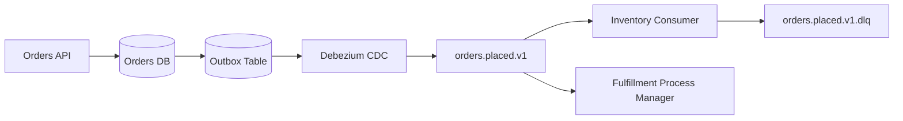
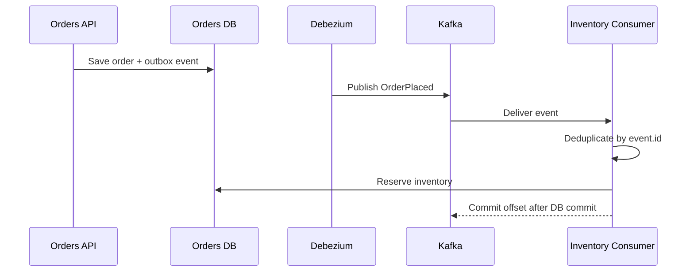

# Architecture Documentation Workflow

Use this when the user asks for an architecture document, design doc, RFC, ADR, technical plan, implementation plan, migration plan, platform decision, or decision-ready reference for a distributed system.

The goal is not to write a pretty essay. The goal is to create a document that helps engineers and stakeholders make decisions, implement consistently, review trade-offs, and operate the system.

## When to create a document

Create or propose an architecture document when:

- The design crosses service, team, data ownership, region, or reliability boundaries.
- The implementation introduces a broker, workflow engine, schema, service mesh, cache, shard, queue, or new consistency model.
- Multiple plausible architectures exist and trade-offs matter.
- The user asks for a plan, RFC, ADR, technical spec, design doc, migration plan, or reference document.
- Future agents or engineers will need durable context to avoid re-litigating decisions.

For small local code changes, use inline notes or a short checklist instead.

## Document types

| Type                        | Use when                                   | Output                                              |
| --------------------------- | ------------------------------------------ | --------------------------------------------------- |
| Architecture Overview       | Explaining how the system works end-to-end | Components, flows, contracts, ops model             |
| RFC / Design Proposal       | A decision is not final yet                | Options, trade-offs, recommendation, open questions |
| ADR                         | Recording one specific decision            | Context, decision, consequences, status             |
| Implementation Plan         | Work needs to be executed in slices        | Milestones, tasks, tests, rollout                   |
| Migration Plan              | Moving from old to new architecture        | Phases, compatibility, backfill, rollback           |
| Production Readiness Review | Assessing launch readiness                 | Findings, checklist, SLOs, runbooks, risks          |
| Event Contract Spec         | Designing message/API contracts            | CloudEvents, AsyncAPI, schema, owners               |

## Required architecture doc sections

For a full design doc, include these sections unless the user asks for a shorter artifact:

```markdown
# <System / Feature Name> Architecture

## 1. Executive Summary

One-page summary of what is being built, why, recommended design, and key risks.

## 2. Goals And Non-Goals

Clear scope. Include measurable outcomes and explicitly excluded work.

## 3. Context

Current system, business drivers, users, constraints, assumptions, and related decisions.

## 4. Requirements

Functional requirements, quality attributes, compliance/security requirements, and SLOs.

## 5. Proposed Architecture

Components, ownership, service boundaries, data ownership, APIs/events, and deployment topology.

## 6. Pattern Mapping

Named systems, integration, and distributed systems patterns with the modern tools used to realize them.

## 7. Data And Contracts

Schemas, CloudEvents/AsyncAPI/OpenAPI links, source of truth, retention, PII, and compatibility.

## 8. Message And Request Flows

Step-by-step flows for happy path, failure path, retry/DLQ, replay, and backfill.

## 9. Consistency And Transactions

Consistency model, outbox/inbox, idempotency, ordering, saga/process manager, and compensation.

## 10. Scale And Performance

Expected volume, bottlenecks, partitioning, autoscaling, capacity, latency, and cost considerations.

## 11. Resilience And Failure Modes

Timeouts, retries, circuit breakers, bulkheads, backpressure, load shedding, multi-region, DR.

## 12. Observability And Operations

Metrics, logs, traces, dashboards, alerts, runbooks, ownership, redrive/replay, SLOs.

## 13. Security And Compliance

AuthN/AuthZ, IAM/ACLs, encryption, secrets, PII, audit, data residency, threat model.

## 14. Alternatives Considered

At least 2-3 plausible options with trade-offs and why they were rejected.

## 15. Rollout And Migration Plan

Phases, compatibility, feature flags, dual-write/dual-read if needed, backfill, rollback.

## 16. Testing And Verification

Unit, integration, contract, load, chaos/failure, replay, migration, and operational tests.

## 17. Risks, Open Questions, And Decisions Needed

Decision log, unresolved questions, risk register, and owner/date for each.
```

## Pattern mapping table

Include a table like this:

| Concern            | Pattern                      | Tool / implementation               | Why                              | Verification             |
| ------------------ | ---------------------------- | ----------------------------------- | -------------------------------- | ------------------------ |
| DB write + publish | Transactional Outbox         | Postgres outbox + Debezium -> Kafka | Avoid dual-write                 | Outbox transaction test  |
| Duplicate delivery | Idempotent Receiver          | Inbox table unique on `event_id`    | At-least-once delivery           | Duplicate delivery test  |
| Workflow state     | Process Manager              | Temporal workflow                   | Queryable saga with compensation | Replay/compensation test |
| Overload           | Backpressure + Rate Limiting | Bounded worker pool + token bucket  | Protect downstream dependency    | Load test                |
| Scaling            | Queue-Based Scaling          | KEDA on Kafka lag                   | Match workers to backlog         | Autoscaling test         |

## Architecture decision record template

Use ADRs for durable decisions. Keep each ADR focused on one decision.

```markdown
# ADR-<number>: <Decision Title>

## Status

Proposed | Accepted | Superseded | Deprecated

## Date

YYYY-MM-DD

## Context

What forces, constraints, and requirements led to this decision?

## Decision

What did we decide?

## Consequences

Positive and negative consequences. Include operational and organizational impact.

## Alternatives Considered

- Option A: trade-offs
- Option B: trade-offs

## Verification

How will we know the decision works in production?

## Related

Links to design docs, schemas, tickets, dashboards, runbooks.
```

## RFC / proposal template

Use this when stakeholders still need to choose.

```markdown
# RFC: <Title>

## Summary

Short recommendation and decision needed.

## Problem

What pain, risk, or opportunity are we addressing?

## Goals / Non-Goals

What must be true when this is done? What is out of scope?

## Options

### Option 1: <Name>

Architecture, pros, cons, risks, cost.

### Option 2: <Name>

Architecture, pros, cons, risks, cost.

### Option 3: <Name>

Architecture, pros, cons, risks, cost.

## Recommendation

Chosen option and why.

## Pattern Mapping

Named systems, integration, and distributed systems patterns.

## Rollout

Phases, compatibility, rollback, migration.

## Decision Log

Questions that need a decision, owner, due date.
```

## Diagram guidance

When asked for diagrams, prefer text-native diagrams that can live in the repo:

- C4 Context: users, external systems, top-level services.
- C4 Container: services, databases, brokers, queues, caches, workflows.
- Sequence diagram: request/message flows, retries, DLQ, compensation.
- State diagram: workflow/process manager states.
- Deployment diagram: regions, clusters, subnets, dependencies.

Mermaid examples:





## Quality attributes matrix

Every architecture doc should explain quality trade-offs:

| Attribute    | Target                            | Design support                          | Risk                              |
| ------------ | --------------------------------- | --------------------------------------- | --------------------------------- |
| Availability | 99.9% checkout event ingestion    | Kafka RF=3, idempotent consumers, DLQ   | Broker partition misconfiguration |
| Latency      | p95 under 2s to reserve inventory | Per-order partitioning, bounded workers | Hot order/account keys            |
| Durability   | No committed order event lost     | Outbox + CDC, `acks=all`                | Outbox connector lag              |
| Operability  | DLQ triage under 15 min           | Dashboard, alert, runbook               | No owner on downstream failures   |
| Security     | No PII in broker logs/DLQ         | Schema classification, redaction        | Accidental payload expansion      |

## Risk register

Use this format. Dates are placeholders; fill in concrete review-by dates when adopting this template.

| Risk                         | Impact | Likelihood | Mitigation                            | Owner    | Date         |
| ---------------------------- | ------ | ---------- | ------------------------------------- | -------- | ------------ |
| Hot partition by `tenant_id` | High   | Medium     | Use `order_id`; monitor partition lag | Platform | <YYYY-MM-DD> |

## Implementation plan format

```markdown
## Milestones

1. Contract and schemas
   - Define AsyncAPI/CloudEvents contract.
   - Add schema compatibility CI.
   - Tests: contract compatibility.

2. Producer outbox
   - Add outbox table.
   - Write event in same transaction.
   - Tests: domain write + outbox atomicity.

3. Consumer reliability
   - Add inbox/dedup.
   - Add retry/DLQ.
   - Tests: duplicate, poison, retry.

4. Observability and operations
   - Dashboards, alerts, runbook.
   - Replay/redrive drill.

5. Rollout
   - Shadow publish, canary consumers, full rollout, retirement.
```

## Architecture review rubric

Before finalizing a document, check:

- Does it name the patterns and tools?
- Does it state why messaging/distribution is needed instead of simpler local design?
- Does it define owners and boundaries?
- Does it answer reliability and distributed-systems checklists?
- Does it include failure paths, not only happy paths?
- Does it include alternatives and trade-offs?
- Does it include rollout, rollback, migration, and verification?
- Does it include operations, security, compliance, and cost?
- Are open questions explicit with owners?

## User-friendly writing rules

- Start with the recommendation and decision needed.
- Keep domain terms consistent.
- Prefer tables for trade-offs and ownership.
- Put diagrams near the sections they explain.
- Use exact channel/API names.
- Use concrete numbers where known; mark assumptions clearly.
- Separate "decided" from "open".
- Make it useful to engineers implementing later and leaders approving now.
